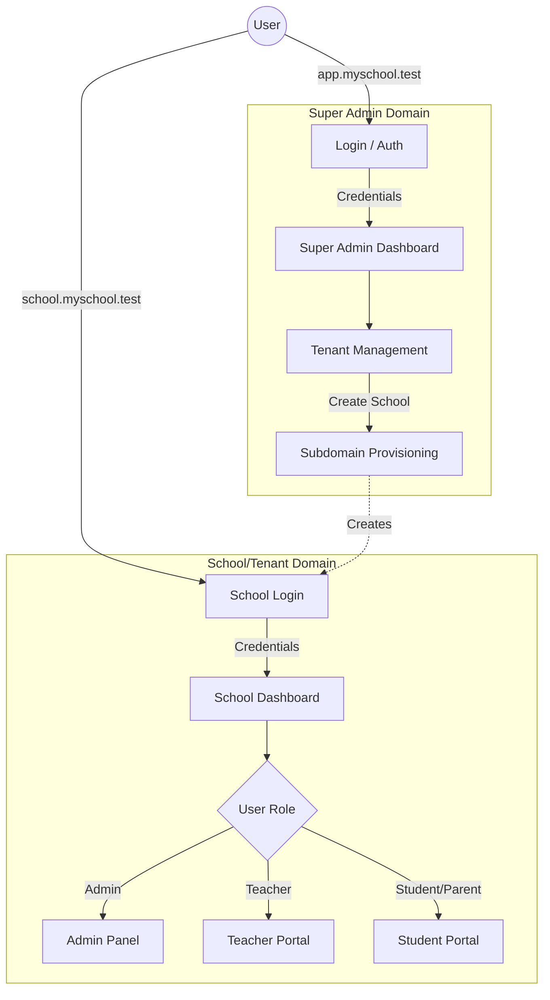
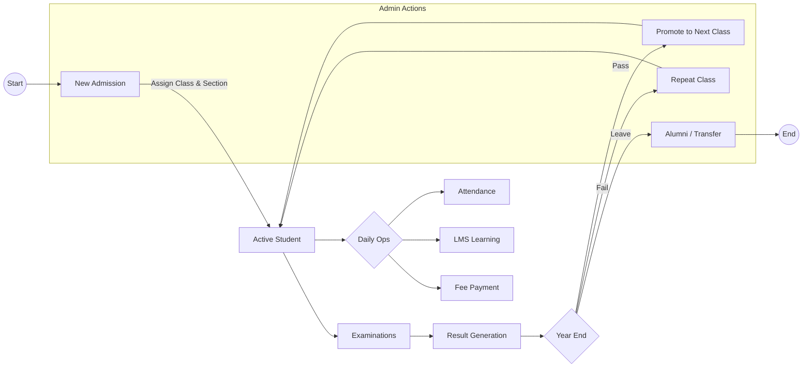
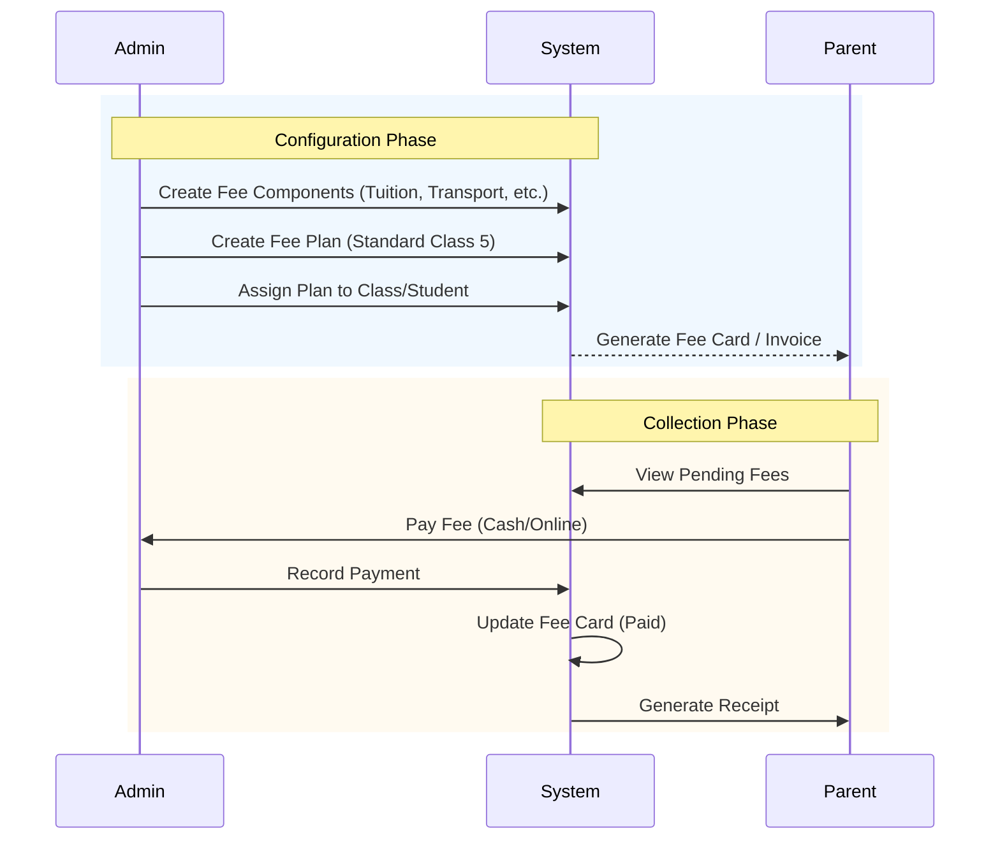
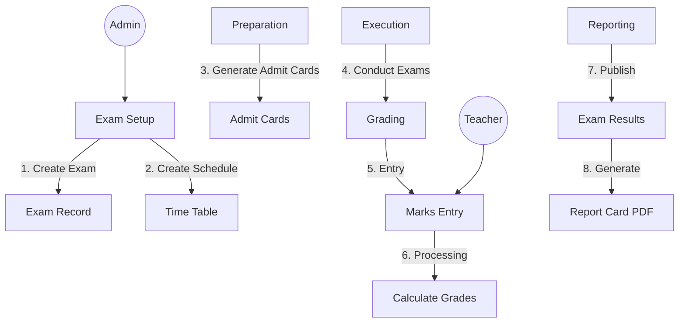
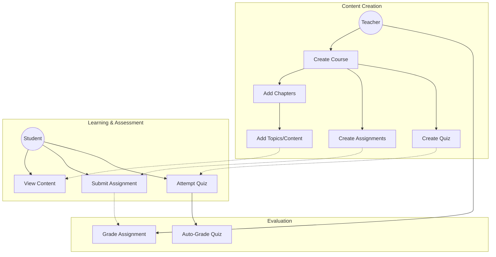

# Software Usage Flow & Architecture

This document visualizes the core operational flows of the School ERP system based on the current implementation.

## 1. High-Level Architecture (Multi-Tenancy)
The system is divided into two distinct domains: the Super Admin (SaaS owner) and the Tenant (School).



## 2. Student Lifecycle Flow
This flow tracks a student from admission to promotion/graduation.



## 3. Fee Management Flow
How fee structures are created, assigned, and collected.



## 4. Examination & Grading Flow
The process of setting up exams, conducting them, and generating report cards.



## 5. LMS (Learning Management System) Flow
The flow for creating and consuming educational content.



## 6. Detailed Attendance Flow
The logic behind marking attendance, handling notifications, and reporting.

```mermaid
graph TD
    User[User (Admin/Teacher)] --> SelectAction{Select Action}
    
    SelectAction -->|Daily Attendance| MarkDaily[Mark Class Attendance]
    SelectAction -->|Period Attendance| MarkPeriod[Mark Period Attendance]
    
    subgraph "Processing Logic"
        MarkDaily -->|Submit| Validate[Validate Input]
        MarkPeriod -->|Submit| Validate
        
        Validate -->|Success| SaveDB[Update DB (student_attendance)]
        
        SaveDB --> CalcSummary[Recalculate Monthly Summary]
        
        CalcSummary --> CheckAbsent{Is Absent?}
        CheckAbsent -->|Yes| NotifyAbsent[Send Absent SMS/Email]
        CheckAbsent -->|No| CheckLow{< 75% Attendance?}
        
        CheckLow -->|Yes| NotifyLow[Send Low Attendance Warning]
        CheckLow -->|No| Finish
    end
    
    subgraph "Reporting"
        Dashboard[Attendance Dashboard] --> DailyStats[Daily Stats]
        Dashboard --> MonthlySummary[Monthly Summary]
        
        ReportGen[Report Generation] --> Types{Report Types}
        Types --> DailyRep[Daily Report]
        Types --> MonthlyRep[Monthly Report]
        Types --> StudentRep[Student Wise]
        Types --> DefaulterRep[Defaulters List]
        
        Types --> Export[Export PDF/Excel]
    end
```
